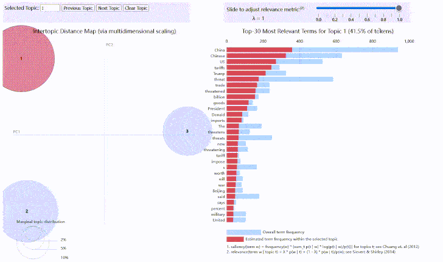

```{r message=FALSE, warning=FALSE}
library(stringr)
library(sentimentr)
library(dplyr, quietly = TRUE)
library(reshape2)
library(tidyr)
library(tidytext)
setwd('D:/R-4.0.0/RStudio.workfile')
tweet.df <- read.csv("en_china_threat.csv",header = T,encoding = 'UTF-8')
tweet.df <- tweet.df[1:1000,]
colnames(tweet.df) <- c("id","text")
tweet.df <- data.frame(tweet.df["text"])
#查看每个句子大概包含多少个字符
charnum <- as.vector(sapply(tweet.df,nchar))
hist(charnum,breaks = 20)
library(tm)
## 初步数据清洗
tweet.df$text =str_replace_all(tweet.df$text,"[\\.\\,\\;]+", " ")
tweet.df$text =str_replace_all(tweet.df$text,"http\\w+", "")
tweet.df$text =str_replace_all(tweet.df$text,"@\\w+", " ")
tweet.df$text =str_replace_all(tweet.df$text,"[[:punct:]]", " ")
tweet.df$text =str_replace_all(tweet.df$text,"[[:digit:]]", " ")
tweet.df$text =str_replace_all(tweet.df$text,"^ ", " ")
tweet.df$text =str_replace_all(tweet.df$text,"[<].*[>]", " ") 

library(caret)
#使用sentiment()函数得到情感评分
sentiment.score <- sentiment(tweet.df$text)
tweet.df$polarity <- sentiment.score$sentiment
tweet.final <- tweet.df[,c('text','polarity')]
tweet.final$sentiment <- ifelse(tweet.final$polarity <0, "Negative","Positive")
table(tweet.final$sentiment)

tweet.final$sentiment <- as.factor(tweet.final$sentiment)
#平衡数据集,重复在positive中采样
tweet.final <- upSample(x = tweet.final$text, y = tweet.final$sentiment)
names(tweet.final) <- c('text', 'sentiment')
head(tweet.final)
table(tweet.final$sentiment)
tweet.final$id <- seq(1, nrow(tweet.final))

tweet.text <- tweet.final[,1]
#创建语料库
tweet.text <- Corpus(VectorSource(tweet.text))
#去除停用词
tweet.text <- tm_map(tweet.text,removeWords,stopwords())

tweet.dtm <- DocumentTermMatrix(tweet.text)

freq.terms <- sort(colSums(as.matrix(tweet.dtm)),decreasing = TRUE)
freq.terms <- data.frame(name = names(freq.terms),
                         fre = freq.terms,row.names = NULL)
head(freq.terms,10)
length(which(freq.terms$fre>100))
library(wordcloud)
set.seed(623) # to make it reproducible


## 将文本数据从语料库中转化为dataframe
polaritydf <- data.frame(text=sapply(tweet.text, identity), stringsAsFactors=F)
polaritydf$label <- rep(c("pos","neg"),each = length(polaritydf$text)/2)
## 对比分析两种情感评论的用词长度
wordlist <- str_split(polaritydf$text,"[[:space:]]+")
wordlen <- unlist(lapply(wordlist,length))
polaritydf$wordlen <- wordlen


##negtive word 的长度稍长
wordfre <- polaritydf%>%unnest_tokens(word,text)%>%
  group_by(label,word)%>%
  summarise(Fre = n())%>%
  arrange(desc(Fre)) %>%
  acast(word~label,value.var = "Fre",fill = 0)

```

```{r message=FALSE, warning=FALSE}
## 可视化两种类型情感对比的词云
comparison.cloud(wordfre,scale=c(4,.5),max.words=180,
                 title.size=1.5,colors = c("darkgreen","darkred"))
#找出出现较为频繁的词语,出现频率大于5
dict <- names(which(wordfre[,1]+wordfre[,2] >5))
tw.dtm <- DocumentTermMatrix(tweet.text,control = list(dictionary = dict))
#由于矩阵比较 稀疏,再控制一下稀疏程度
tw.dtm <- removeSparseTerms(tw.dtm,0.99)

```

```{r message=FALSE, warning=FALSE}
library(lda)
library(LDAvis)
library(servr)
term_table <- table(unlist(wordlist))
term_table <- sort(term_table, decreasing = TRUE)
term_table[1:20]
dim(term_table)

## 剔除空的数据,否则json报错
del <- (names(term_table)) %in% c("")
term_table <- term_table[!del]
dim(term_table)

# 删除出现次数小于10次的词语
del <- term_table < 10
term_table <- term_table[!del]
vocab <- names(term_table)

# 将数据整理为lda包可使用的形式
get_terms <- function(x) {
  index <- match(x, vocab)
  index <- index[!is.na(index)]
  rbind(as.integer(index - 1), as.integer(rep(1, length(index))))
}
documents <- lapply(wordlist, get_terms)

## documents[[i]]：表示第i个文档
## documents[[i]][1,j] : 表示文档i中第j个单词对应在词库中的（索引－1）
## documents[[i]][2,j] : 表示文档i中第j个单词出现的次数

## 使用lda模型
alpha <-  0.02;eta <- 0.02

t1 <- Sys.time()
fit <- lda.collapsed.gibbs.sampler(documents = documents, K = 3, 
                                   vocab = vocab, 
                                   num.iterations = 50, alpha = alpha, 
                                   eta = eta, initial = NULL, burnin = 0,
                                   compute.log.likelihood = TRUE)
t2 <- Sys.time()
t2 - t1  # about 30 sec on laptop
dim(fit$topics)
## 可视化lda模型
## 对模型进行可视化

theta <- t(apply(fit$document_sums + alpha, 2, function(x) x/sum(x)))
phi <- t(apply(t(fit$topics) + eta, 2, function(x) x/sum(x)))
doc_length <- sapply(documents, function(x) sum(x[2, ]))
term_frequency <- as.vector(term_table)
pol_ldavis <- list(phi = phi,theta = theta,doc_length = doc_length,
                   vocab = vocab,term_frequency = term_frequency)

# create the JSON object to feed the visualization:
json <- createJSON(phi = pol_ldavis$phi, 
                   theta = pol_ldavis$theta, 
                   doc.length = pol_ldavis$doc_length, 
                   vocab = pol_ldavis$vocab, 
                   term.frequency = pol_ldavis$term_frequency)

serVis(json, out.dir = "vis")
```
## Networdk3D

```{r message=FALSE, warning=FALSE}
library(networkD3)
library(igraph)
library(RTextTools)
library(magrittr)
#bigram
TweetDf <- data.frame(as.character(tweet.final$text))
names(TweetDf) <- "text"
bi.gram.words <- TweetDf %>% 
  unnest_tokens(
    input = text, 
    output = bigram, 
    token = 'ngrams', 
    n = 2
  ) %>% 
  filter(! is.na(bigram))
extra.stop.words <- c('https')
stopwords.df <- tibble(
  word = c(stopwords(kind = 'es'),
           stopwords(kind = 'en'),
           extra.stop.words)
)
bi.gram.words %<>% 
  separate(col = bigram, into = c('word1', 'word2'), sep = ' ') %>% 
  filter(! word1 %in% stopwords.df$word) %>% 
  filter(! word2 %in% stopwords.df$word) %>% 
  filter(! is.na(word1)) %>% 
  filter(! is.na(word2)) 
bi.gram.count <- bi.gram.words %>% 
  dplyr::count(word1, word2, sort = TRUE) %>% 
  dplyr::rename(weight = n)


threshold <- 20
filter=dplyr::filter
network <-  bi.gram.count %>%
  filter(weight > threshold) %>%
  graph_from_data_frame(directed = FALSE)

# Store the degree.
V(network)$degree <- strength(graph = network)
# Compute the weight shares.
E(network)$width <- E(network)$weight/max(E(network)$weight)

# Create networkD3 object.
network.D3 <- igraph_to_networkD3(g = network)
# Define node size.
network.D3$nodes %<>% mutate(Degree = (1E-2)*V(network)$degree)
# Define color group
network.D3$nodes %<>% mutate(Group = 1)
# Define edges width. 
network.D3$links$Width <- 10*E(network)$width

forceNetwork(
  Links = network.D3$links, 
  Nodes = network.D3$nodes, 
  Source = 'source', 
  Target = 'target',
  NodeID = 'name',
  Group = 'Group', 
  opacity = 0.9,
  Value = 'Width',
  Nodesize = 'Degree', 
  # We input a JavaScript function.
  linkWidth = JS("function(d) { return Math.sqrt(d.value); }"), 
  fontSize = 12,
  zoom = TRUE, 
  opacityNoHover = 1
)
```

## LDA可视化动图
